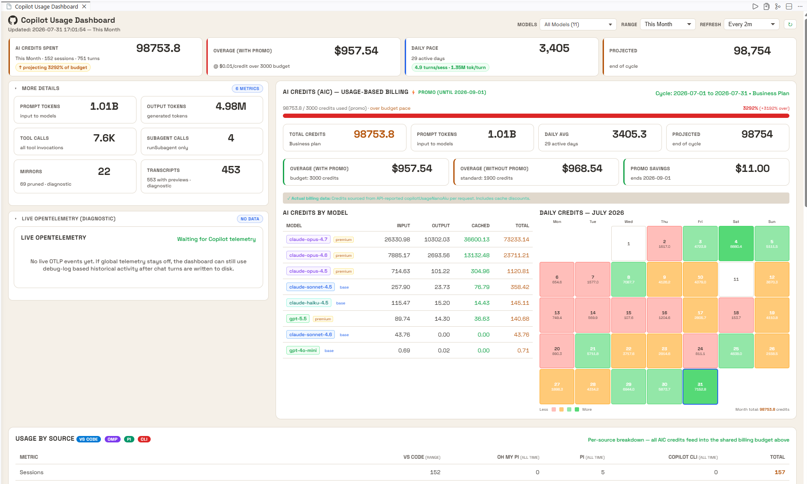

# Copilot Usage Dashboard

<p align="center">
  
</p>

A VS Code extension that shows token usage, AI Credits, and cost across GitHub Copilot Chat, [Oh My Pi](https://github.com/can1357/oh-my-pi), and [Pi](https://github.com/earendil-works/pi) sessions.

## Install

```
npm install
npm run compile
npx @vscode/vsce package --allow-missing-repository
code --install-extension copilot-usage-dashboard-*.vsix
```

## Open

Command Palette → `Copilot Usage: Open Dashboard`

## Configure

Settings → search `copilotUsage`.

Common settings:

| Setting                                 | Default    | Purpose                                |
| --------------------------------------- | ---------- | -------------------------------------- |
| `copilotUsage.aic.plan`                 | `business` | Copilot plan for credit budget         |
| `copilotUsage.aic.overageCostPerCredit` | `0.01`     | USD per AI credit                      |
| `copilotUsage.dailyLimit.enabled`       | `false`    | Opt in to the daily spend guard        |
| `copilotUsage.dailyLimit.dollars`       | `0`        | Daily USD cap (0 = use credit cap)     |
| `copilotUsage.workspaceStoragePath`     | auto       | Override VS Code workspaceStorage root |

Full configuration reference, data sources, and internals: [ARCHITECTURE.md](ARCHITECTURE.md)

## License

MIT
